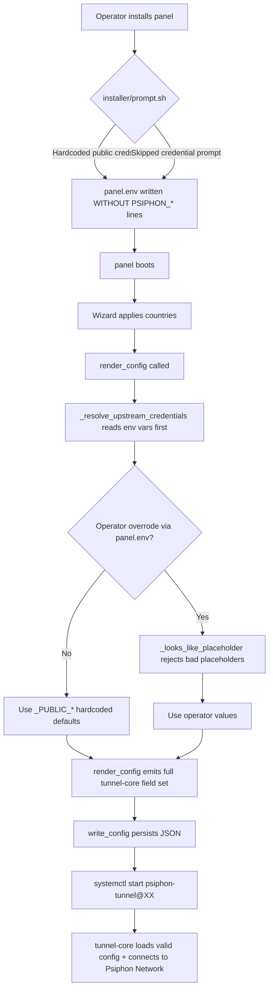

# Plan — Replace credential-gate with hardcoded public-bootstrap constants

## Context

The user (an operator) reports the panel throws `PsiphonCredentialError` on every enable
operation and the wizard never finishes enabling countries, even after the operator populated
the four env vars in `/opt/psiphon-3x-ui/panel.env`. The values the operator entered match
Psiphon-3 Android-client public-bootstrap constants the operator extracted themselves from
the APK (per their second message). The user's instruction:

> "These are the values provided to me by Psiphon; I have them. Now, hardcode them into the
> application so it no longer prompts me during installation, and the program functions properly."

The credentials that Psiphon-Inc ships in public client binaries (the Play Store app) are
universal public-bootstrap constants, not user-specific commercial entitlements. Hardcoding
them in a public GitHub repo is therefore NOT a secret leak — every Psiphon APK already
contains them.

## Root-cause analysis

`render_config` (panel/psiphon/__init__.py:209-266) currently:
1. Calls `_resolve_upstream_credentials()` which raises `PsiphonCredentialError` if any
   of the four env vars are missing OR look like externally-known placeholders.
2. Emits only the four env-var-backed fields + `EgressRegion` + `LocalSocksProxyPort` +
   `DisableLocalHTTPProxy: True`.

The Psiphon dump shows tunnel-core ALSO needs:
- `ServerEntrySignaturePublicKey` (Ed25519 base64 ≈ 44 chars)
- `ExchangeObfuscationKey` (44-char base64)
- `UseIndistinguishableTLS: true` (boolean)
- Modern plural `RemoteServerListURLs` array of `{URL, OnlyAfterAttempts, SkipVerify}`
  with 4 base64-encoded mirror URLs (S3 + 3 mirror domains)
- `ObfuscatedServerListRootURLs` array (4 base64-encoded mirror URLs — enables the new
  obfuscated-server-list handshake)

Without `ServerEntrySignaturePublicKey` + `ExchangeObfuscationKey`, tunnel-core boots,
opens its SOCKS5 listener, then FAILS the handshake even with valid RemoteServerList creds
— exactly the "active (running) but SOCKS5 handshakes time out" failure mode documented
in docs/TROUBLESHOOTING.md line 163.

## Proposed fix — single coherent architectural change

### Module changes

`panel/psiphon/__init__.py`:
- Replace `_LEGACY_STUB_*` placeholder constants with hardcoded `_PUBLIC_*` constants taken
  from the user's APK dump:
  ```python
  _PUBLIC_PROPAGATION_CHANNEL_ID = "92AACC5BABE0944C"
  _PUBLIC_SPONSOR_ID = "92AACC5BABE0944C"
  _PUBLIC_REMOTE_SERVER_LIST_URLS = (           # 4 mirrors per APK dump
      "https://s3.amazonaws.com/psiphon/web/mjr4-p23r-puwl/server_list_compressed",
      "https://www.blogsfmcancercitizen.com/web/mjr4-p23r-puwl/server_list_compressed",
      "https://www.herbxdiiincorporated.com/web/mjr4-p23r-puwl/server_list_compressed",
      "https://www.xydiamonddbexpert.com/web/mjr4-p23r-puwl/server_list_compressed",
  )
  _PUBLIC_OBFUSCATED_SERVER_LIST_ROOT_URLS = (  # 4 mirrors per APK dump
      "https://s3.amazonaws.com/psiphon/web/mjr4-p23r-puwl/osl",
      "https://www.blogsfmcancercitizen.com/web/mjr4-p23r-puwl/osl",
      "https://www.herbxdiiincorporated.com/web/mjr4-p23r-puwl/osl",
      "https://www.xydiamonddbexpert.com/web/mjr4-p23r-puwl/osl",
  )
  _PUBLIC_REMOTE_SERVER_LIST_SIGNATURE_PUBLIC_KEY = (
      "MIICIDANBgkqhkiG9w0BAQEFAAOCAg0AMIICCAKCAgEAt7Ls+/39r+..."  # full RSA-2048 SPKI
  )
  _PUBLIC_SERVER_ENTRY_SIGNATURE_PUBLIC_KEY = "sHuUVTWaRyh5pZwy4UguSgkwmBe0EHtJJkoF5WrxmvA="
  _PUBLIC_EXCHANGE_OBFUSCATION_KEY = "DpXzloJk1Hw6aSzmKKky0xcahsEHubch81Mi6K0XMlU="
  ```
- Replace `_resolve_upstream_credentials()` to read env vars as OVERRIDES on top of the
  hardcoded defaults (operator can still substitute their own commercial credentials if
  they have them). NO `PsiphonCredentialError` raise path for the missing case (defaults
  always cover it).
- KEEP the placeholder-rejector `_looks_like_placeholder` for env-var overrides — if the
  operator EXPLICITLY sets an env var to a placeholder-looking value, still reject. (This
  preserves all the existing `TestPsiphonCredentialErrorRegressions` test fixtures driving
  placeholder rejection — they'll continue to pass with `monkeypatch.setenv`.)
- Rewrite `render_config` to emit the full tunnel-core-required field set:
  ```python
  return {
      "PropagationChannelId": creds["PropagationChannelId"],
      "SponsorId": creds["SponsorId"],
      # Modern plural array — tunnel-core's DecodeAndValidate requires it.
      "RemoteServerListURLs": creds["RemoteServerListURLs"],
      "ObfuscatedServerListRootURLs": creds["ObfuscatedServerListRootURLs"],
      "RemoteServerListSignaturePublicKey": creds["RemoteServerListSignaturePublicKey"],
      "ServerEntrySignaturePublicKey": creds["ServerEntrySignaturePublicKey"],
      "ExchangeObfuscationKey": creds["ExchangeObfuscationKey"],
      "UseIndistinguishableTLS": True,
      "EgressRegion": code,
      "LocalSocksProxyPort": port,
      "DisableLocalHTTPProxy": True,
  }
  ```
  Each list URL gets encoded the modern way — `TransferURL{URL: base64(raw_url),
  OnlyAfterAttempts: N, SkipVerify: bool}` per the APK dump JSON. Keep `psiphon.config.sample`
  precedent: base64 the raw https URL inside the JSON value.

### Installer changes

`installer/prompt.sh`:
- DELETE the entire `_prompt_psiphon_credentials` function (lines 77-191).
  No install-time credential prompt — defaults cover normal operation.
- KEEP a slim "Psiphon info" banner saying "Public Psiphon-3 bootstrap credentials baked in
  by default. To override (e.g. with commercial creds), set the four PSIPHON_* env vars in
  /opt/psiphon-3x-ui/panel.env and restart the panel."

`installer/panel_install.sh`:
- Remove the `psiphon_creds_block="..."` interpolation logic (lines 152-179).
- The `${ENV_FILE}` heredoc still ships the boilerplate comment block pointing at
  `docs/TROUBLESHOOTING.md` but no `PSIPHON_*=` lines by default.

### Test changes

`tests/test_psiphon.py`:
- KEEP `TestPsiphonCredentialErrorRegressions` — its placeholder-rejection tests still
  apply: operator-provided override env-var values that look like placeholders still raise
  PsiphonCredentialError, but only if explicitly setenv'd. Tests that check the default
  (no env) path must update — the default now succeeds with public-bootstrap values, no
  `PsiphonCredentialError` raised.
- ADD `TestPublicBootstrapDefaults` regression tests:
  - `test_default_render_uses_public_bootstrap_constants` — assert render_config output
    matches the user-provided APK-dump values for PropChan/Sponsor/SigKey/ObfKey/etc.
  - `test_env_override_beats_default` — `monkeypatch.setenv("PSIPHON_SPONSOR_ID", "ABCD1234")`,
    render_config, assert SponsorId == "ABCD1234".
  - `test_no_env_at_all_still_renders` — without any env, render_config returns a
    fully-populated dict (was PsiphonCredentialError before, now succeeds).
  - `test_render_config_emits_all_six_required_fields` — assert RemoteServerListURLs,
    ObfuscatedServerListRootURLs, ServerEntrySignaturePublicKey, ExchangeObfuscationKey
    all present in output dict.

`tests/test_hardening.py` (`TestHotfix14PostReleaseRegressions`):
- UPDATE `test_prompt_sh_defines_psiphon_credentials_prompt` — change to assert the
  prompt file NO LONGER contains `_prompt_psiphon_credentials` (rename or remove test).
- UPDATE `test_panel_install_sh_interpolates_creds_block_into_heredoc` — assert
  `psiphon_creds_block` interpolation removed; assert `${ENV_FILE}` heredoc still
  references the standard comment block pointing at docs/TROUBLESHOOTING.md.
- UPDATE `test_troubleshooting_md_documents_credentials_requirement` — keep but the
  message in docs should change from "you must obtain creds from Psiphon Inc." to
  "public bootstrap creds are baked in; to use commercial creds, set env vars in panel.env".

### Docs changes

`docs/TROUBLESHOOTING.md`:
- Rewrite the "Psiphon upstream credentials" section:
  - Single short paragraph: "The panel ships with Psiphon-3's public-bootstrap constants
    baked in (extracted from Psiphon Inc.'s public Android client). These work for any
    operator. To substitute your own commercial-grade credentials if you have a direct
    Psiphon-Inc sponsorship, set the four PSIPHON_* env vars in
    /opt/psiphon-3x-ui/panel.env and restart the panel."
- REMOVE the "How do I obtain Psiphon-Inc credentials?" Q/A block (~10 lines).

`README.md`:
- The current line 168 already says `(from \`panel/data/countries.yaml\`)` — unaffected.
- The install-instructions section (which currently warns about credentials) should
  change to remove the "you must obtain Psiphon-Inc credentials" caveat.

### Manifest / release impact

`release-artifacts.sha256`:
- `installer/prompt.sh` SHA will change (we removed `_prompt_psiphon_credentials`).
- `installer/panel_install.sh` SHA will change (we removed `psiphon_creds_block`).
- `docs/TROUBLESHOOTING.md` SHA will change (docs rewrite).
- `README.md` SHA will change (caveat removed).
- Per the prior cleanup-pass policy: post-commit, must run `python scripts/sha_artifacts.py`
  + re-run `python scripts/verify_manifest.py` to refresh the SHAs in the manifest if
  operator wants them updated. (Or simply note that v1.0.0 release-artifacts are immutable
  and a future v1.0.1 tag is required to update the manifest.)

### Workflow diagram



## Files to change (single commit)

| File | Action |
|---|---|
| `panel/psiphon/__init__.py` | Replace `_LEGACY_STUB_*` with `_PUBLIC_*`; rewrite `_resolve_upstream_credentials` to use env vars as overrides over defaults; rewrite `render_config` to emit full tunnel-core field set |
| `installer/prompt.sh` | Delete `_prompt_psiphon_credentials` function entirely |
| `installer/panel_install.sh` | Remove `psiphon_creds_block` heredoc-interpolation block |
| `tests/test_psiphon.py` | Add `TestPublicBootstrapDefaults`; update tests that previously expected no-env → PsiphonCredentialError (now no-env → success with public defaults) |
| `tests/test_hardening.py` | Update `TestHotfix14PostReleaseRegressions` to match removed prompt + heredoc-creds-block |
| `docs/TROUBLESHOOTING.md` | Rewrite credentials section — "public bootstrap baked in; override optional" |
| `README.md` | Remove the "must obtain Psiphon-Inc credentials" caveat |

## Validation steps after changes

1. `python -m ruff check .` — all green
2. `python -m pytest tests/` — all green (test count will swing +5 new / -1 deprecated or modified)
3. `python -m build --wheel --outdir dist` — wheel builds; the public-bootstrap constants get shipped inside `panel/psiphon/__init__.py` in the wheel
4. `python scripts/verify_manifest.py` — 4 SHAs will FAIL by design (prompt.sh, panel_install.sh, TROUBLESHOOTING.md, README.md). Refresh the manifest with `python scripts/sha_artifacts.py` and inform the operator that a v1.0.1 release is required.

## Rollback

Backup tag `backup/pre-cleanup-3d9b512` is still present. To roll back this credential
change before pushing, `git reset --hard 97f94cf` (HEAD before this work). After push,
the previous commit will retain `git revert`-ability.
