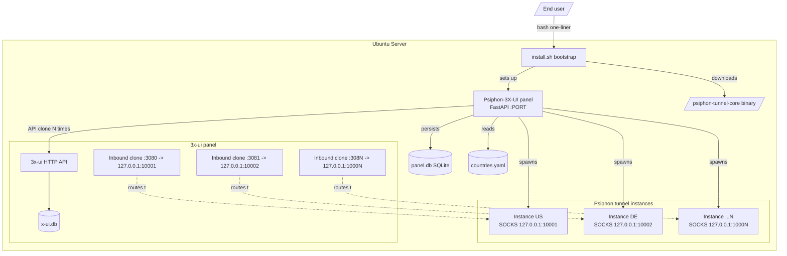
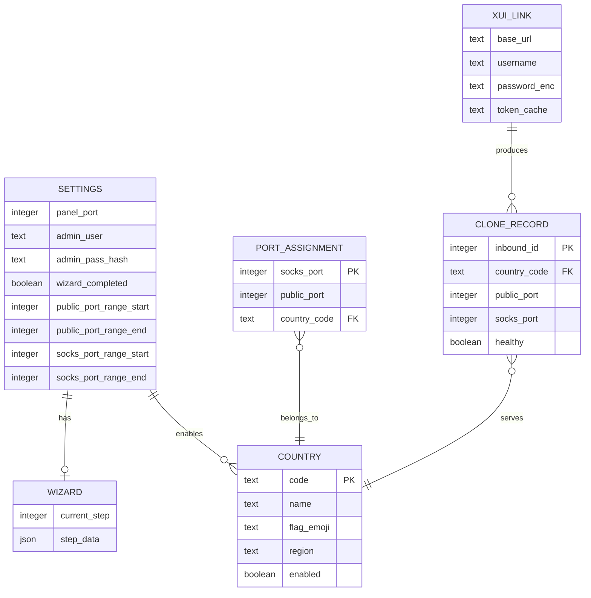
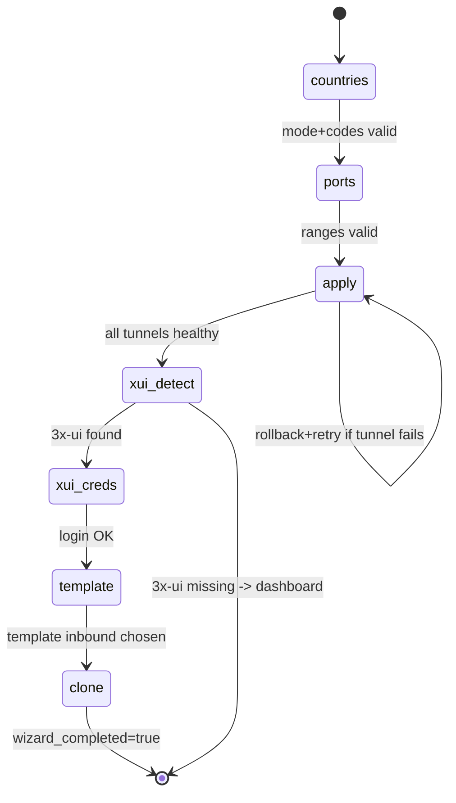

# Psiphon for 3X-UI — Project Plan & Roadmap

> A companion panel that installs Psiphon (`Psiphon-Labs/psiphon-tunnel-core`) alongside
> Sanaei's `3x-ui` panel on an Ubuntu server, exposing per-country outbound traffic
> through clones of an existing `3x-ui` inbound.

---

## 1. Executive Summary

The product is a **one-line installer + a companion web panel** ("Psiphon-3X-UI").
On first run it launches a **setup wizard** that:

1. Downloads/installs the official Psiphon Go binary.
2. Stores panel credentials + port (manual or randomly generated).
3. Lets the user pick **all countries** or **specific countries**.
4. Collects an **internal SOCKS port range** and a **public inbound port range**
   (or accepts smart recommendations).
5. Spins up one Psiphon tunnel instance per selected country, each exposing a
   local `127.0.0.1:<socks_port>` SOCKS5 proxy tagged with `EgressRegion`.
6. Detects `3x-ui` and asks for its **API credentials**.
7. Reads one inbound to use as a **clone template**.
8. Clones that inbound once per country, wiring each clone's outbound to the
   matching local SOCKS port, and names it `[ 🇺🇸 United States ] :3080`.
9. From the second login onward the wizard is replaced by a compact
   management dashboard for add/remove/edit of countries, ports, and
   inbound×country mappings.

The whole thing is free, open-source, and globally usable.

---

## 2. Key Technical Decisions (locked from clarifying Q&A)

| Decision | Choice | Rationale |
|---|---|---|
| Country list source | `panel/data/countries.yaml` (shipped inside the wheel) | Forward-compatible with Psiphon region additions |
| Installer one-liner | `curl` → `wget` fallback | Works on minimal Ubuntu installs |
| Panel stack | **Python 3.11 + FastAPI** + lightweight HTML/JS (Alpine.js + Pico.css) | Easy to maintain, ships with Ubuntu's Python, small footprint |
| 3x-ui integration | Official 3x-ui **HTTP API** (`/panel/api/inbounds/*`) | Stable, supported, avoids SQLite corruption risk |

---

## 3. System Architecture

### 3.1 Component diagram



### 3.2 Per-country traffic flow

```mermaid
flowchart LR
    Client[User device] -->|vless/vmess etc on public inbound port| Inbound["3x-ui inbound clone<br/>[ flag Country ] :PORT"]
    Inbound -->|outbound = socks<br/>127.0.0.1:SOCKS_PORT| Local["Local SOCKS5"]
    Local --> PsiphonTunnel["Psiphon tunnel proc<br/>EgressRegion=US sync"]
    PsiphonTunnel -->|encrypted tunnel| PsiphonNet[Psiphon network]
    PsiphonNet --> Exit[Exit server in selected country]
    Exit --> Site[Internet]
```



---

## 4. Repository Structure

```
psiphon-3x-ui/
├── install.sh                      # Bootstrap one-liner target (curl|bash)
├── README.md                       # Project description + one-liner install command
├── LICENSE                         # MIT (truly free / global)
├── .github/
│   └── workflows/
│       ├── ci.yml                  # Lint, ruff, pytest, shellcheck
│       └── release.yml             # Build + attach release assets on tag
├── installer/
│   ├── bootstrap.sh                 # curl/wget-aware top-level script
│   ├── deps.sh                     # apt installs (python3-venv, curl, jq, ufw, ...)
│   ├── psiphon_install.sh          # Download + verify checksum of psiphon-tunnel-core
│   ├── panel_install.sh            # Create venv, install panel wheel, write systemd unit
│   ├── firewall.sh                 # Open chosen public inbound range
│   └── prompt.sh                   # Port/username/password interactive prompts
├── panel/
│   ├── pyproject.toml              # Poetry / pip build config
│   ├── requirements.txt
│   ├── main.py                     # FastAPI app entrypoint + uvicorn launcher
│   ├── config.py                   # Panel config load/save (port,user,hash pass)
│   ├── auth.py                    # bcrypt + JWT session
│   ├── models.py                   # SQLAlchemy models (panel.db)
│   ├── db.py                       # SQLite session, init_db()
│   ├── wizard/
│   │   ├── router.py               # /api/wizard/* endpoints (state machine)
│   │   └── steps.py                # Country select, ports, api creds, clone template
│   ├── dashboard/
│   │   ├── router.py               # /api/dashboard/* (add/remove/edit country)
│   │   ├── tunnels.py              # Start/stop/restart Psiphon instances
│   │   └── xui_client.py           # Thin 3x-ui API client (login, list, add, del)
│   ├── psiphon/
│   │   ├── runner.py               # Subprocess manager for N tunnel processes
│   │   ├── config_gen.py           # Build per-country psiphon config JSON
│   │   └── health.py               # SOCKS reachability probe
│   └── static/
│       ├── index.html              # SPA shell
│       ├── wizard.html
│       ├── dashboard.html
│       ├── assets/
│       │   ├── app.js              # Alpine.js components
│       │   ├── styles.css          # Pico.css customizations
│       │   └── flags.css           # Country flag emoji glyphs
│       └── robots.txt
├── config/
│   ├── countries.yaml              # Configurable country list (code,name,flag,region)
│   └── panel.defaults.toml         # sane defaults
├── systemd/
│   └── psiphon-3x-ui.service        # systemd unit for panel
│   └── psiphon-tunnel@.service      # templated unit, one per country: US,DE,...
└── docs/
    ├── ARCHITECTURE.md
    ├── COUNTRIES.md                # How to extend countries.yaml
    ├── XUI_API.md                  # 3x-ui endpoint notes
    └── TROUBLESHOOTING.md
```

---

## 5. Data Model (panel.db)



---

## 6. The 12 Requirements — Traceability Matrix

| # | User requirement | Where it's implemented | Status in plan |
|---|---|---|---|
| 1 | One-line installer launches Psiphon install | `install.sh` → `bootstrap.sh` → `psiphon_install.sh` | ✅ Phase 2 |
| 2 | Ask port + user + pass (manual or random) | `installer/prompt.sh`, `panel/auth.py` | ✅ Phase 2 |
| 3 | Show IP+port output, browser login | `install.sh` final echo, `panel/auth.py` | ✅ Phase 2 |
| 4 | First-login setup wizard | `panel/wizard/router.py`, `static/wizard.html` | ✅ Phase 3 |
| 5 | Country selection — All / Specific | Wizard step 1 endpoint `POST /api/wizard/countries` | ✅ Phase 3 |
| 6 | Internal SOCKS + public inbound port ranges, smart rec | Wizard step 2 endpoint `POST /api/wizard/ports` | ✅ Phase 3 |
| 7 | Auto-config, log + progress bar | Wizard step 3 endpoint `POST /api/wizard/apply` (SSE stream) | ✅ Phase 4 |
| 8 | Detect 3x-ui, ask API creds | Wizard step 4 endpoint `POST /api/wizard/xui-creds` | ✅ Phase 4 |
| 9 | Fetch inbounds, pick template | Wizard step 5 endpoint `POST /api/wizard/clone-template` | ✅ Phase 4 |
| 10 | Clone inbound N times | `panel/dashboard/xui_client.py` `clone_inbound()` | ✅ Phase 5 |
| 11 | Routing + outbounds + multi-instance with EgressRegion | `panel/psiphon/runner.py` + `xui_client.py` | ✅ Phase 4-5 |
| 12 | Inbound name `[ flag Country ] :port` | `xui_client.py` `make_inbound_payload()` | ✅ Phase 5 |

Bonus: post-wizard management dashboard → `panel/dashboard/router.py`, `static/dashboard.html` (Phase 6).

---

## 7. Phased Roadmap

### Phase 0 — Bootstrap & Project Skeleton
- [ ] Create GitHub repo `psiphon-3x-ui`, set MIT LICENSE, branch protection.
- [ ] Add `.gitignore`, `pyproject.toml`, `ruff.toml`, `shellcheck` config.
- [ ] CI: `actions/setup-python`, `ruff check`, `pytest`, `shellcheck installer/*.sh`.
- [ ] Stub `README.md` with the future install one-liner (placeholder URL).

### Phase 1 — 3x-ui API Surface (validate assumptions first!)
- [ ] Stand up a disposable Ubuntu VM with **3x-ui already installed**.
- [ ] Reverse-engineer the canonical flow:
  1. `POST /{webBasePath}/login` → cookie session
  2. `GET /panel/api/inbounds/list`
  3. `POST /panel/api/inbounds/add` (clone payload — known JSON shape from 3x-ui source)
  4. `POST /panel/api/inbounds/update/{id}` (routing/outbound edits)
- [ ] Write `panel/dashboard/xui_client.py` thin client; cover with `pytest` against the VM.
- [ ] Document findings in [`docs/XUI_API.md`](docs/XUI_API.md:1).
- [ ] Key gotcha to confirm: inbound `routing` rules + per-inbound `outbound` must
      reference the local SOCKS5 outbound — verify how to inject an outbound entry
      per clone (3x-ui stores outbounds inside the inbound's `streamSettings`
      `sockopt`/`routing`) — this is the biggest technical risk.

### Phase 2 — Installer (`install.sh`)
- [ ] `bootstrap.sh`: detect `curl` else use `wget`; ensure root; check Ubuntu 20.04+/22.04+.
- [ ] `deps.sh`: `python3-venv`, `python3-pip`, `python3-build`, `setuptools`,
      `jq`, `ufw`, `curl`, `wget`, `git`, `tar`, `golang-go` (≥1.21 for upstream module support).
- [ ] `psiphon_install.sh` — **build from source** (resolved during Phase 2 spike:
      the upstream `psiphon-tunnel-core` GitHub release ships only the Android/iOS/
      Client-Library Go-source zips — **no prebuilt linux_amd64 binary and no
      published SHA256 checksum**; see §10 risk row update below):
  - `git clone --depth 1 --branch <PINNED_TAG>` of `Psiphon-Labs/psiphon-tunnel-core`
    into a build scratch dir (pinned tag — v1 ships with `v2.0.39`).
  - `cd ConsoleClient && GOOS=linux GOARCH=amd64 go build -ldflags "$LDFLAGS"`
    following the upstream `make.bash` recipe (set `-X ...buildinfo.buildRepo`,
    `-X ...buildinfo.buildRev=<tag-sha>`, `-X ...goVersion=...`, `-s -w`).
  - Install the resulting `psiphon-tunnel-core-x86_64` to `${BIN_DIR}/psiphon-tunnel-core`,
    `chmod 0750`, ownership `root:psiphon3xui`.
  - Record the freshly-built binary's SHA256 to `${INSTALL_PREFIX}/psiphon-tunnel-core.sha256`
    (we built it ourselves, so the hash is a tamper-detection baseline, not an upstream check).
- [ ] `prompt.sh`: ask panel port (default random 10000-60000), username (default random), password (default random 16-char). Use `read -s` for password.
- [ ] `panel_install.sh`:
  - Create a dedicated `psiphon3xui` system user/group.
  - Create venv `/opt/psiphon-3x-ui/venv`.
  - `pip install --upgrade pip build` then `python -m build --wheel` the `panel/` package; `pip install ./panel/dist/*.whl`.
  - Run `panel.seed` (new module) which writes `panel.db`: bcrypt-hashed credentials
    + singleton `Settings` row (panel_port, admin_user, admin_pass_hash, wizard_completed=false).
  - Generate a 32-byte session secret and write it to `${ENV_FILE}`
    (`PSIPHON3XUI_SESSION_SECRET=...`, `PSIPHON3XUI_DB_PATH=...`,
    `PSIPHON3XUI_HOST=0.0.0.0`, `PSIPHON3XUI_PORT=<PANEL_PORT>`).
  - Render the `systemd/psiphon-3x-ui.service` template into `/etc/systemd/system/`
    with `EnvironmentFile=${ENV_FILE}` + `ExecStart=${VENV_DIR}/bin/python -m panel`.
  - `systemctl daemon-reload && systemctl enable --now psiphon-3x-ui`.
- [ ] `firewall.sh`: open chosen panel port only (public inbound range opened later by wizard).
- [ ] `install.sh` flags: `--uninstall` (stop+disable service, leave 3x-ui inbounds intact with a warning); re-run = idempotent upgrade.
- [ ] Final echo block:
  ```
  ── Psiphon-3X-UI installed ───────────────
   Web UI : http://<SERVER_IP>:<PORT>
   User   : <USER>
   Pass   : <PASS>      (shown once)
   Log    : /opt/psiphon-3x-ui/install.log
  ──────────────────────────────────────────
  ```

### Phase 3 — Panel Core + Wizard Backend (steps 1 & 2)
- [ ] [`panel/main.py`](panel/main.py:1): FastAPI app, `/auth/login`, static mount.
- [ ] [`panel/auth.py`](panel/auth.py:1): bcrypt verify + signed session cookie (itsdangerous).
- [ ] `GET /api/me` → 401 if not logged in, else `{ wizard_completed: bool }`.
- [ ] Wizard is an **idempotent state machine** persisted in `WIZARD` table.
- [ ] `POST /api/wizard/countries` — body `{mode: "all"|"specific", codes: [...]}`, validates against `countries.yaml`.
- [ ] `POST /api/wizard/ports` — body:
  ```json
  {
    "socks":   {"start": 10001, "end": 10032},
    "public":  {"start": 30000, "end": 30031},
    "assignment": "one_per_country" | "shared_range",
    "use_recommendation": false
  }
  ```
  Validation: ranges must not collide with panel port or each other; `one_per_country` requires `end - start + 1 >= len(countries)`.
  Smart recommendation generator: pick smallest free ranges scanning `/proc/net/tcp` + `ss -tlnp`.

### Phase 4 — Wizard Backend (steps 3, 4, 5) + Psiphon runner
- [ ] `POST /api/wizard/apply` — Server-Sent Events stream:
  - For each selected country: build per-country config
    ```json
    {
      "PropagationChannelId": "...",
      "RemoteServerListURLs": ["https://..."],
      "RemoteServerListSignaturePublicKey": "...",
      "EgressRegion": "<CODE>",
      "LocalSocksProxyPort": <SOCKS_PORT>,
      "DisableLocalHTTPProxy": true
    }
    ```
    saved to `/opt/psiphon-3x-ui/config/<CODE>.json`.
  - Spawn `psiphon-tunnel-core` process under the templated systemd unit
    `psiphon-tunnel@<CODE>.service`.
  - Emit SSE `{step, country, status, progress}` for the progress bar.
- [ ] Health probe: open `127.0.0.1:<SOCKS_PORT>` SOCKS5 handshake, mark `healthy`.
- [ ] Detect 3x-ui: probe common web paths (`/panel/`, `/<custom>/`) and `/usr/local/x-ui/x-ui.db`.
- [ ] `POST /api/wizard/xui-creds` — body `{base_url, username, password}` → attempt login, cache token (encrypted) in `XUI_LINK`.
- [ ] `GET /api/wizard/inbounds` → proxy to `GET /panel/api/inbounds/list`, return simplified `[{id, remark, port, protocol}]`.
- [ ] `POST /api/wizard/clone-template` — body `{template_inbound_id}` → store for step ahead.

### Phase 5 — Cloning Engine + Wizard Finalize
- [ ] `xui_client.clone_inbound(template, country, socks_port, public_port)`:
  1. Fetch template JSON from `GET /panel/api/inbounds/get/<id>`.
  2. Clone with new:
     - `remark`: `[ 🇺🇸 United States ] :<public_port>`
     - `port`: `<public_port>`
     - `streamSettings.sockopts` / `routing.outbounds[0]` → SOCKS5 `127.0.0.1:<socks_port>`
     - unique client-side UUIDs.
  3. `POST /panel/api/inbounds/add` with payload.
  4. Persist [`CLONE_RECORD`](panel/models.py:1) row.
  5. Mark `WIZARD.current_step = done`, `SETTINGS.wizard_completed = true`.
- [ ] Rollback logic: if any clone fails, delete previously created inbounds in this batch (transaction-like via API `del`).
- [ ] Final wizard response: summary table of country → inbound port → SOCKS port → remark.

### Phase 6 — Management Dashboard (post-wizard)
- [x] `static/dashboard.html` + alpine `app.js` sections:
  - **Countries**: list with enable/disable toggle, add country (re-runs instance spawn)
  - **Ports**: edit SOCKS/Public per country, "Re-apply" button (regenerates configs, restarts units, updates 3x-ui inbound)
  - **Inbounds**: link to 3x-ui panel, re-clone template button, health badge
  - **Logs**: tail of systemd journal for selected tunnel
  - **Backup**: export/restore `panel.db` + `config/*.json`
  - **Settings**: rotate admin password, change panel port (with firewall sync)
- [x] `panel/dashboard/router.py`:
  - `GET /api/dashboard/countries`
  - `PATCH /api/dashboard/countries/{code}` (enable/disable)
  - `POST /api/dashboard/countries/{code}/_ports`
  - `DELETE /api/dashboard/countries/{code}`
  - `GET /api/dashboard/tunnels/{code}/logs?lines=200`
  - `POST /api/dashboard/reapply`
  - `POST /api/dashboard/backup`, `POST /api/dashboard/restore` (+ `rotate-password`, `change-panel-port`)

### Phase 7 — Hardening, Docs, Release
- [x] Security: HTTPS via self-signed cert option [`installer/https_install.sh`](installer/https_install.sh); CSRF tokens ([`panel/auth.py`](panel/auth.py) + [`panel/main.py`](panel/main.py) middleware, env-gated via `PSIPHON3XUI_CSRF_ENFORCE`); rate-limit [`/auth/login`](panel/main.py).
- [x] Idempotency: re-running `install.sh` upgrades in place, preserves config (documented in [`install.sh`](install.sh) + [`README.md`](README.md)).
- [x] Uninstall script `install.sh --uninstall` (stops services, leaves 3x-ui inbounds intact with a warning) — implemented at [`install.sh`](install.sh) (lines 156-184).
- [x] Translations scaffold: [`panel/i18n/en.json`](panel/i18n/en.json) + [`panel/i18n/__init__.py`](panel/i18n/__init__.py) + `GET /api/i18n/{locale}` endpoint.
- [x] [`README.md`](README.md) finalized with copy-paste one-liner (v1.0.0 tag URL), HTTPS subsection, dashboard, 26-row API table, Security section, Configuration reference, and release procedure:
  ```bash
  sudo bash <(curl -sL https://raw.githubusercontent.com/DonMonro/p/v1.0.0/install.sh) \
    || sudo bash <(wget -qO- https://raw.githubusercontent.com/DonMonro/p/v1.0.0/install.sh)
  ```
- [ ] Tag `v1.0.0`, GitHub Release with SHA256 manifest — pending operator approval (final 7k step).

---

## 8. Wizard State Machine



---

## 9. Suggestions / Corrections to the Original Spec

I've packaged these in good faith — a few items in the prompt warrant refinement:

1. **Country count.** Psiphon's `EgressRegion` set is **not exactly 32**; it changes with the upstream build. Hardcoding any number risks drift. The `countries.yaml` approach handles this elegantly — v1 ships with today's supported regions (~32) but is editable. **Recommendation: don't promise "32" in the UI; say "X available".**

2. **"Public inbound ports per country vs range."** Each country needs its own listening port in 3x-ui (inbound `port` field is a single integer, not a range). The "range" the user enters is really a **pool** from which one port is assigned per country. UI should clarify this so users aren't confused.

3. **Cloning one inbound N times.** A 3x-ui inbound describes a listener + protocol. Cloning is fine, but **each clone must get its own SSH/random client params** if they exist, otherwise the same client can connect to different country clones with identical UUIDs. The clone engine must regenerate per-clone UUIDs. (Confirmed as a real risk in the 3x-ui model.)

4. **Routing vs outbound.** 3x-ui's per-inbound "routing/outbound" lives in different JSON fields depending on protocol (VLESS vs VMess vs Trojan). The clone engine must read the **template's protocol** and apply the right outbound-injection shape. **This is the #1 technical risk** — Phase 1 validation must finalize the exact JSON mutation per protocol.

5. **Psiphon "PropagationChannelId" / RemoteServerListSignaturePublicKey.** These are required constants from the Psiphon Labs release. The installer must embed them (they ship in the public source tree as constants). Confirm they still ship in the latest release during Phase 2.

6. **"Freely usable globally."** Add explicit LICENSE (MIT) and ensure we **redistribute the Psiphon binary only as a download link**, not bundled, to comply with Psiphon Labs' license. README must credit both upstream projects.

7. **3x-ui not installed.** If 3x-ui isn't detected, the wizard can still complete — tunnels and local SOCKS proxies will be usable manually. Offer a "skip integration" path rather than blocking.

8. **Firewall.** Remember to open the **public inbound range** in `ufw` during wizard apply, not at install time (we don't know the range yet at install time).

9. **Subscription links / clients.** The prompt's last line ("user only needs to create a client or import link") is handled inside 3x-ui itself; our panel should deep-link to the 3x-ui inbound view for convenience.

10. **Optional dashboard extras I'd recommend adding** (you asked for suggestions):
    - **Per-country latency / health ping** — auto-run SOCKS probe every 60s, surface red/green badges.
    - **Traffic counters** — pull 3x-ui `up`/`down` per clone, show country leaderboard.
    - **Bulk enable/disable** (e.g. "disable Africa region").
    - **Preset profiles** — favorite country bundles the user can quickly re-apply after edits.
    - **Scheduled rotation** — optionally rotate which country a given inbound points to on a cron.
    - **Multi-server mode** (future) — manage several 3x-ui backends from one panel.

---

## 10. Risks & Mitigations

| Risk | Impact | Mitigation |
|---|---|---|
| 3x-ui outbound JSON shape varies by protocol | Clones won't route to SOCKS | Phase 1 spike; per-protocol clone templates; unit test against live 3x-ui |
| Psiphon binary license/keys change upstream | Tunnels fail to start | **Build from source** (no upstream prebuilt Linux server binary exists); pin a `git tag` in `psiphon_install.sh` (v1 ships with `v2.0.39`); build with the upstream `make.bash` recipe; record our freshly-built binary's SHA256 as a tamper baseline; `countries.yaml` editable for `EgressRegion` drift |
| Psiphon exits blocked in some regions | "Country X never connects" | Health probe + auto-retry + clear red badge |
| User picks overlapping port ranges | Conflicts at apply | Validator rejects; smart-recommendation scans `ss -tlnp` |
| Per-clone UUID collision | Same client creds across clones | Clone engine regenerates UUIDs always |
| 3x-ui API auth cookie format changes | Integration breaks | Pin tested 3x-ui version in `docs/XUI_API.md`; version check on connect |

---

## 11. Definition of Done (v1.0)

- One-liner installs on a fresh Ubuntu 22.04 + 3x-ui VM end-to-end.
- Wizard completes for both "all countries" and "specific countries" paths.
- Cloned inbounds appear in 3x-ui with correct `[ flag Country ] :port` remarks.
- A client connected to a clone reaches the internet via the chosen country (verified via `curl --socks5 ipinfo.io/json`).
- Dashboard edit persists across panel restart.
- CI green; README replayable; release artifact SHA256 published.

---

## 12. Next Action

Switch to **Code mode** and start with **Phase 0** (repo skeleton + CI), then immediately run the **Phase 1 3x-ui API spike** against a real VM to de-risk the clone-engine design before committing UI work.

This plan is intentionally thorough because the project is global and public — getting the integration contract right early will save painful rework later.
